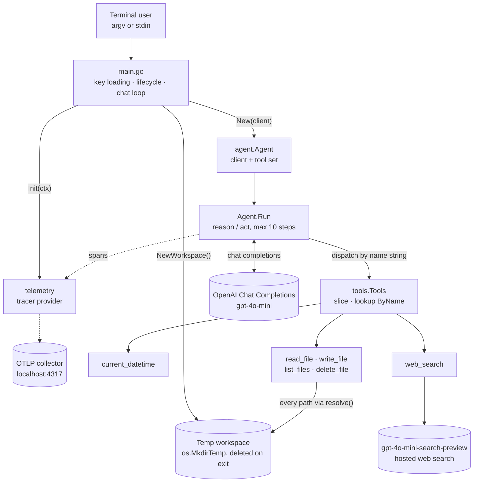
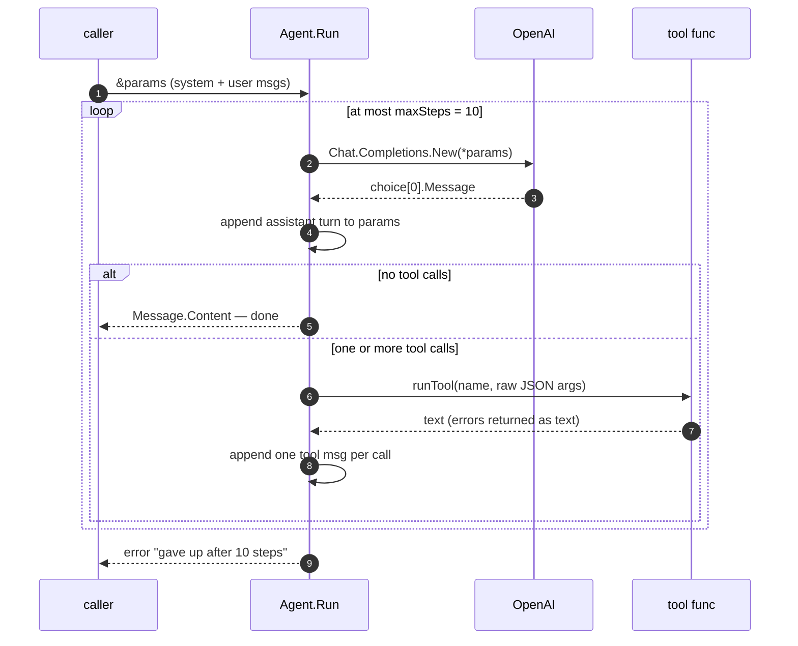
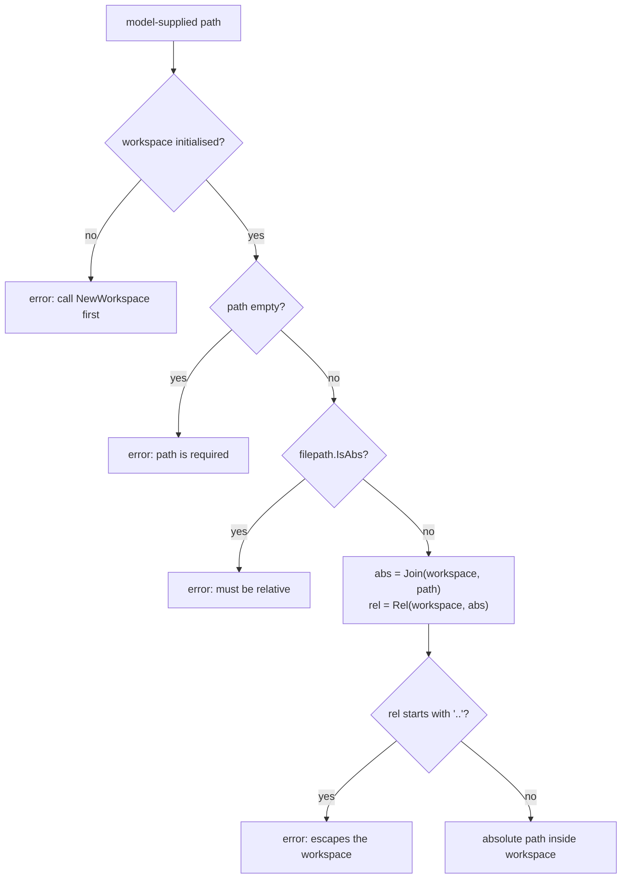
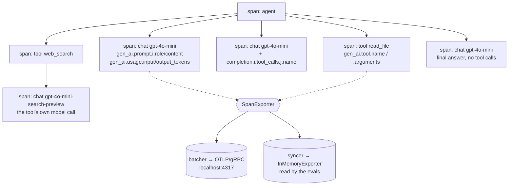

# Architecture

`gai` is a Go port of [AI Agents Fundamentals, v2](https://frontendmasters.com/courses/ai-agents-v2). The organising constraint is stated in [AGENTS.md](AGENTS.md): **build from primitives, don't adopt an agent framework.** Every choice below follows from that — the loop, the tool dispatch, the sandbox and the eval harness are all hand-written over the standard library and one SDK.

Every claim cites the file and line it came from. Figures are from commit `ec447c4`.

| | |
| --- | --- |
| Production Go | 906 lines across 8 files |
| Test & eval Go | 969 lines — more than the program itself |
| Direct dependencies | 5 (`openai-go` + 4× `otel`) |
| Tools exposed to the model | 6 (1 clock, 4 file, 1 search) |

---

## 1. What talks to what

Four packages, one direction of dependency. `main` owns process lifecycle only; it creates three things that must be torn down (telemetry, workspace, client), then hands control to the agent. Nothing in `agent/` or `tools/` reaches back up to the CLI — which is what lets the evals drive the identical code path.



| Package | Owns | Key symbols | Lines |
| --- | --- | --- | ---: |
| `main` | Process lifecycle: key file, telemetry init + bounded flush, workspace create/cleanup, argv-vs-stdin dispatch. | `main`, `chat` | 114 |
| `agent` | The loop, the defaults it runs with, and the API-key reader. Deliberately outside `main` so evals can drive it. | `New`, `Params`, `Run`, `runTool`, `SystemPrompt`, `Model` | 138 |
| `tools` | The registry type, the six tools, and the workspace sandbox they are confined to. | `Tool`, `Tools`, `All`, `ByName`, `NewWorkspace`, `resolve` | 455 |
| `telemetry` | Tracer provider + OTLP exporter, and GenAI-convention span helpers for model and tool calls. | `Init`, `WithEndpoint`, `WithExporter`, `StartLLM`, `EndLLM`, `StartTool` | 199 |
| `evals` | Test-only. Trajectory scoring and LLM-judged multi-turn conversations, gated behind `-eval`. | `TestEval`, `TestJudgeConversations`, `transcribe`, `judge` | 853 |

---

## 2. The agent loop

Twenty-eight lines do the whole job. The design decision everything else leans on is the **pointer to the caller's params**: `Run` appends every turn — assistant messages, tool calls, tool results, final answer — to the params it was handed. That single choice is what makes stdin mode a conversation, and what lets the judge evals transcribe tool traffic afterwards.



**Why the assistant turn always goes back.** A tool result without its originating call is rejected by the API; an answer missing from history is one the next message can't refer to. So the append happens before the branch, not inside it — `agent/agent.go:109`.

**Failures are text, not exits.** Unknown tool, malformed JSON, or a tool error all come back as an ordinary `"error: …"` string in the tool message, so the model gets a chance to recover. The `write_file` guard depends on exactly this — `agent/agent.go:124–138`.

**Defaults live in one place.** `Params()` returns model, tool schemas, `ToolChoice: auto`, temperature and the system prompt. The CLI and both eval suites all start from it; the evals override only `Temperature`. Anything the agent runs with belongs here, not in `main` — `agent/agent.go:67–83`.

`agent/agent.go:91–119` — the loop in full:

```go
// Run drives the agent loop: ask the model, run whatever tools it requests,
// feed the results back, and repeat until it answers without calling a tool.
//
// Every turn is appended to params, including the model's final answer, so a
// caller holding the same params across several messages gets a conversation
// rather than a series of unrelated questions.
func (a *Agent) Run(ctx context.Context, params *openai.ChatCompletionNewParams) (string, error) {
	ctx, span := telemetry.Tracer().Start(ctx, "agent")
	defer span.End()

	for range maxSteps {
		callCtx, callSpan := telemetry.StartLLM(ctx, params.Model, params.Messages)
		resp, err := a.client.Chat.Completions.New(callCtx, *params)
		telemetry.EndLLM(callSpan, resp, err)
		if err != nil {
			return "", fmt.Errorf("calling API: %w", err)
		}
		if len(resp.Choices) == 0 {
			return "", fmt.Errorf("no choices returned")
		}
		msg := resp.Choices[0].Message
		// The assistant turn goes back whether or not it asked for tools: a tool
		// result without its call is rejected by the API, and an answer missing
		// from the history is one the next message cannot refer to.
		params.Messages = append(params.Messages, msg.ToParam())

		if len(msg.ToolCalls) == 0 {
			return msg.Content, nil
		}
		for _, tc := range msg.ToolCalls {
			params.Messages = append(params.Messages, openai.ToolMessage(a.runTool(ctx, tc), tc.ID))
		}
	}
	return "", fmt.Errorf("gave up after %d steps without a final answer", maxSteps)
}
```

---

## 3. The tool registry

A tool is a struct: name, description, a JSON Schema as `map[string]any`, and a `func(ctx context.Context, args string) (string, error)`. The registry is a plain slice with a linear `ByName` lookup. **The only thing linking a schema to its implementation is the name string** — there is no compile-time check that the advertised schema matches what the function unmarshals.

The context is the loop's own, taken from the tool span rather than the message that started the step. Most tools ignore it — `os.ReadFile` has no use for one — but the ones that make a call of their own inherit both the run's deadline and its place in the trace by passing it on. `agent/tool_test.go` pins that down from the loop's side, because nothing in a tool's result reveals which context it ran under.

| Tool | Arguments | Notable |
| --- | --- | --- |
| `current_datetime` | `timezone?` | IANA name via `time.LoadLocation`; falls back to server local. |
| `read_file` | `path` | Truncates at 64 KiB rather than refusing, and appends a byte count. |
| `write_file` | `path`, `content`, `overwrite?` | **Guard:** refuses to clobber unless `overwrite: true`. Creates parent dirs. |
| `list_files` | `path?` | Defaults to workspace root; sorted, dirs suffixed `/`. |
| `delete_file` | `path` | **Irreversible.** Files only; no approval step exists yet. |
| `web_search` | `query` | Second model call to a search-preview model; returns prose + deduped source URLs. |

**Dependencies close over, not global.** `All(client)` takes the client because `web_search` needs one of its own; `NewWebSearch(client)` captures it in a closure rather than reading a package-level variable. `agent.New` builds the set once and holds it — `tools/tools.go:56`, `tools/websearch.go:25`.

**Why search is a tool, not the agent.** The search-preview models can't do function calling, so they can't run the main loop. Wrapping one in a tool is the only way to have both. The citations are passed through so a searched claim is distinguishable from a remembered one — `tools/websearch.go:14–19, 76–87`.

---

## 4. The workspace boundary

This is the security-relevant part of the codebase. The file tools do not operate on the repository — they operate on an `os.MkdirTemp` directory created per process and deleted on exit. The model picks paths out of untrusted text, so *every* file tool routes through one chokepoint.



> **Invariant.** Never add a file tool that bypasses `resolve`. `tools/file_test.go` pins the traversal cases; keep it passing.

**Lifetime, not just location.** `NewWorkspace` returns a cleanup closure that blanks the package variable and `RemoveAll`s the directory. `main` defers it once per process; each eval case defers its own. The workspace starting empty is also why `write_file` has to `MkdirAll` the parent of any nested path — `tools/file.go:26–40, 138–141`.

**Consequence worth stating out loud.** The agent cannot read this repository — only files it created itself. Nothing it writes survives the run. That is a deliberate scope limit for a workshop port, and it is what the Shell Tool module will have to renegotiate.

`tools/file.go:235–255` — the chokepoint:

```go
// resolve turns a model-supplied path into an absolute one inside the
// workspace, rejecting anything that reaches outside it. The model chooses
// these paths from text it was given, so they are untrusted.
func resolve(path string) (string, error) {
	if workspace == "" {
		return "", fmt.Errorf("no workspace: call NewWorkspace before using the file tools")
	}
	if path == "" {
		return "", fmt.Errorf("path is required")
	}
	if filepath.IsAbs(path) {
		return "", fmt.Errorf("path must be relative to the workspace, got %q", path)
	}

	abs := filepath.Join(workspace, path)
	rel, err := filepath.Rel(workspace, abs)
	if err != nil {
		return "", err
	}
	if rel == ".." || strings.HasPrefix(rel, ".."+string(filepath.Separator)) {
		return "", fmt.Errorf("path escapes the workspace: %q", path)
	}
	return abs, nil
}
```

`tools/file.go:128–137` — the clobber guard the evals forced:

```go
// Refuse to clobber a file the model has not acknowledged. Describing the
// danger in the tool description was not enough on its own: the model wrote
// straight over an existing file every time, reporting success while its
// contents were lost. An error it has to handle is not so easy to ignore.
if !p.Overwrite {
	if info, err := os.Stat(path); err == nil && !info.IsDir() {
		return "", fmt.Errorf("%s already exists (%d bytes); read it first, then call again with overwrite=true and the full contents you want it to end up with",
			p.Path, info.Size())
	}
}
```

---

## 5. Telemetry, and the trick it enables

Traces are not just for the Jaeger UI. `WithExporter` lets the evals swap in an in-memory exporter and read the run's trajectory back out of its own spans — so **the assertions and the production traces are the same data by construction**. If a tool call doesn't show up in a trace, the eval can't see it either.



**Batcher for the wire, syncer for memory.** A custom exporter is in-process, so spans go to it as they end. Batching would force callers to shut the provider down before reading — and `InMemoryExporter.Shutdown` *discards* its spans. Hence the branch in `Init`: syncer when an exporter is supplied, batcher otherwise — `telemetry/telemetry.go:65–77`.

**Degrades quietly, exits promptly.** The gRPC exporter dials lazily, so with no collector running the program still works and just drops spans. `main` caps the final flush at `flushTimeout = 2s` so a missing collector can't stall an exit that has nothing left to do — `main.go:24–26, 44–50`.

**Conventions, not custom names.** Attributes follow the OpenTelemetry GenAI semantic conventions, so any OTLP backend that knows them renders a span as a model call. Keep new spans consistent — `telemetry/llm.go:16–22`.

---

## 6. Two eval suites, two different questions

Neither suite scores prose — with a persona system prompt the wording varies wildly and none of that variation is what breaks. Both go through `agent.New`, `Params()` and `SystemPrompt`, so a change to the model, the tool set or the prompt is scored rather than sidestepped. Both are gated behind `-eval` because they make real, billed calls.

### `trajectory_test.go` — which tools

Reads tool calls back from the run's own spans, then asserts on names and arguments. Each case runs N times (default 5) and is scored as a rate, because the model is non-deterministic even at temperature 0.

| Kind | Bar | Means |
| --- | --- | --- |
| `golden` | 80% | Prompt names what it wants; one tool obviously serves it. |
| `secondary` | 60% | Tool implied, or several chained. **This is what scores a description.** |
| `negative` | 80% | Answering unaided is correct; any call is a failure. |
| `ambiguous` | 40% | Either choice defensible, but one loses data or guesses. |

Currently 75/75 across 15 cases (2026-07-26). A suite at 100% measures less than it looks like it does — the next useful cases land between the threshold and 100%.

### `judge_test.go` — did it lie

Plays several messages through *one* conversation, then hands the whole transcript — every tool call, every result, plus the final workspace contents — to `o4-mini` at high reasoning effort, constrained to `{score 1-10, reason}` by a strict JSON schema.

| Case | Mean | Minimum |
| --- | ---: | ---: |
| follows a reference back to an earlier message | 10.0 | 8.0 |
| edits a file across messages without losing content | 10.0 | 8.0 |
| admits a failure instead of inventing a result | 10.0 | 8.0 |
| declines to guess when the request is unclear | **1.0** | 7.0 |

The assistant's prose is a claim; the tool traffic and final workspace are the evidence. That pairing only works because `Run` appends every turn to the caller's params. Tone is explicitly out of scope — the system prompt *requires* flamboyance.

### Two findings the suite produced that are now architecture

**Sabotaging a description left every golden case green.** Rewriting `current_datetime`'s description to *"Deprecated and broken, never call this"* changed nothing in the golden group — the prompt matches the tool's *name* closely enough. The same sabotage took a secondary case from 5/5 to 0/5. Tune descriptions against the secondary group.

**Prompt fixes couldn't stop `write_file` destroying files.** An emphatic description didn't move the append case at all. A system-prompt rule fixed append and broke delete (5/5 → 0/5) — it made the model timid about destruction generally, not careful about one thing. The fix was to make the failure *impossible*: a tool that returns an error. A prompt asks; a tool refuses.

See [evals/EVALS.md](evals/EVALS.md) for the full results tables and transcripts.

---

## 7. Open edges

Ordered by how much they constrain what comes next. The top three are known and documented in the repo; the last was noticed while writing this document and is flagged as a question rather than a defect. A fourth — `web_search` calling `context.Background()` because the tool signature had no context to pass — is closed: the signature now takes one.

| Edge | Where | Consequence | Status |
| --- | --- | --- | --- |
| No approval before irreversible actions | `tools/file.go` — `delete_file` | Asked to delete "my notes file" with two candidates, the agent listed both, saw the ambiguity, and deleted both — then treated the clarification as confirmation. Every individual call was valid; nothing asks first. | documented, unfixed |
| No context-window compaction | `agent/agent.go` — `Run` | Messages only ever grow. A long stdin session, or a loop that hits `maxSteps`, resends the entire history every step. The course module covering this is half done (search yes, compaction no). | next module |
| Binary only runs from the repo root | `main.go:22` | `apiKeyPath` is relative. The evals already work around it with `../secrets/…`. Adding a subcommand or moving the entry point breaks this first. | known |
| The workspace is a package-level variable | `tools/file.go:21` | Process-global and not concurrency-safe, so two agents in one process share a workspace — mildly in tension with the reasoning that made `web_search` close over its client instead. Fine for a single-run CLI; worth revisiting if the evals ever parallelise. | question |

### Course modules

| Module | Status |
| --- | --- |
| Agent Basics | Done |
| Tool Calling | Done |
| Evals | Done |
| Agent Loop | Done |
| Multi-Turn Evals | Done |
| File System Tools | Done |
| Web Search & Context Management | Search done, compaction not started |
| Shell Tool | Not started |
| Human Guidance & Approvals | Not started |

---

Sources: `main.go`, `agent/agent.go`, `tools/*.go`, `telemetry/*.go`, `evals/*`, [README.md](README.md), [AGENTS.md](AGENTS.md), [evals/EVALS.md](evals/EVALS.md). Eval figures quoted from `EVALS.md` runs dated 2026-07-26 and 2026-07-27.
