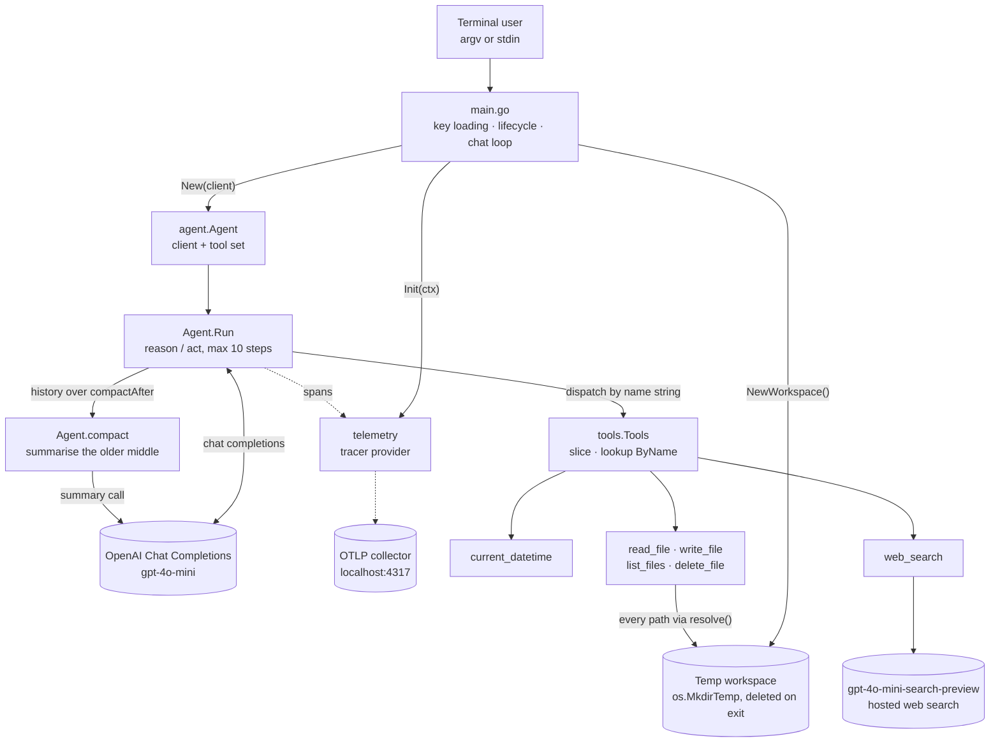
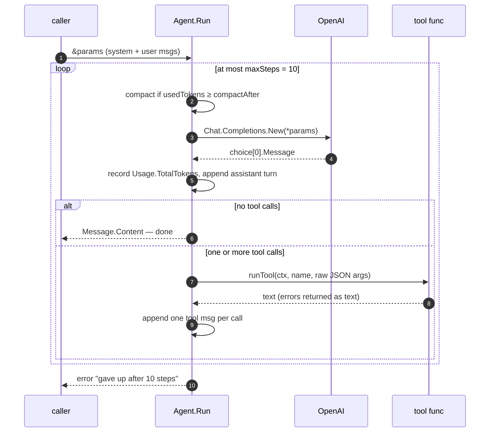
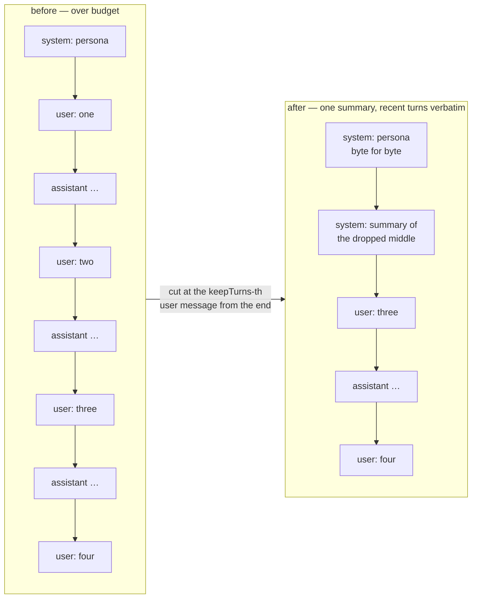
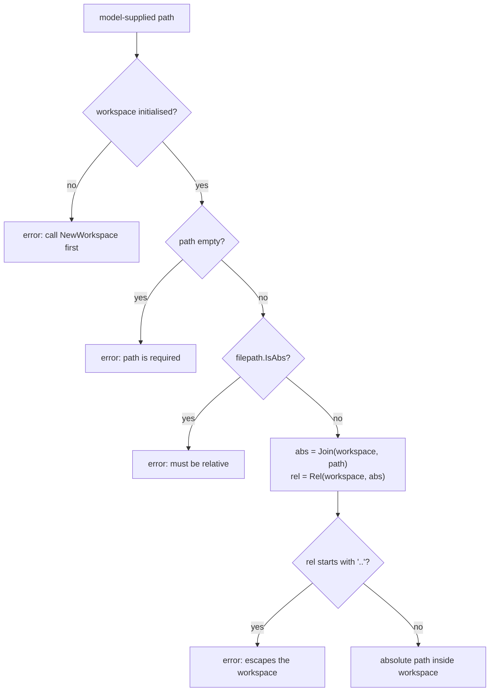
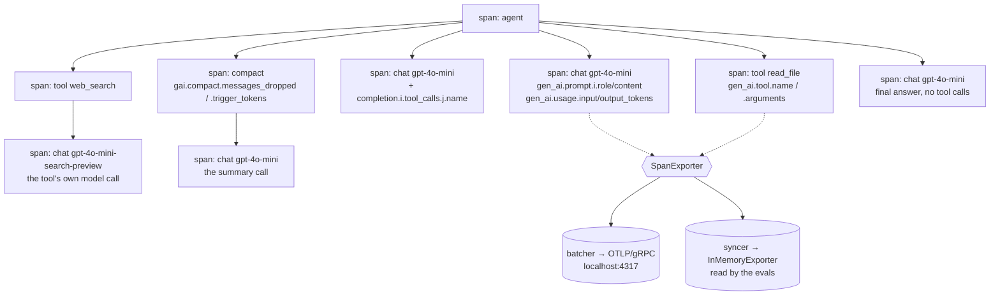
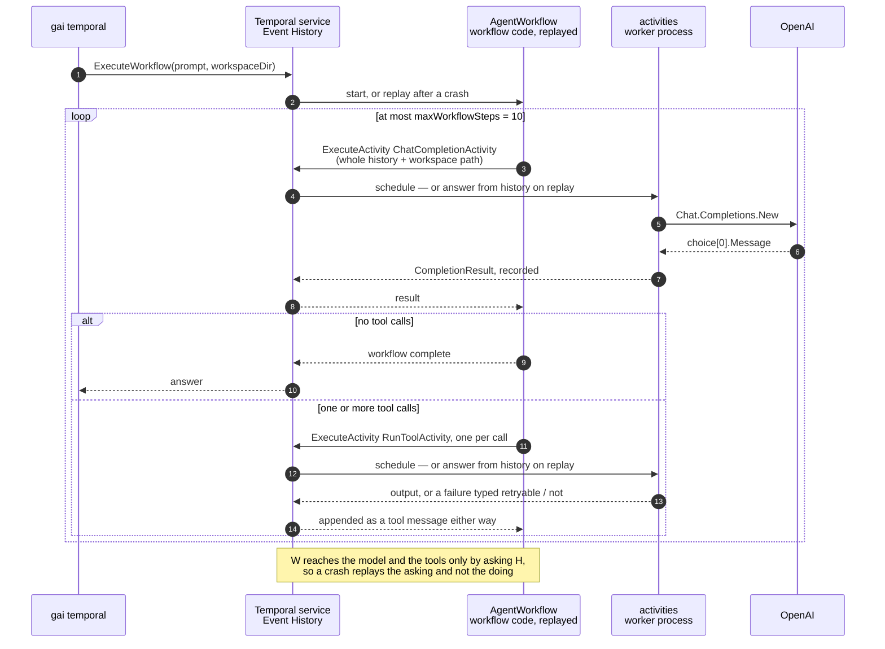

# Architecture

`gai` is a Go port of [AI Agents Fundamentals, v2](https://frontendmasters.com/courses/ai-agents-v2). The organising constraint is stated in [AGENTS.md](AGENTS.md): **build from primitives, don't adopt an agent framework.** Every choice below follows from that — the loop, the tool dispatch, the sandbox and the eval harness are all hand-written over the standard library and one SDK.

Every claim cites the file and line it came from. Figures are from commit `ed0ccee`.

| | |
| --- | --- |
| Production Go | 1504 lines across 11 files |
| Test & eval Go | 1873 lines — more than the program itself |
| Direct dependencies | 5 (`openai-go` + 4× `otel`) |
| Tools exposed to the model | 6 (1 clock, 4 file, 1 search) |

---

## 1. What talks to what

Five packages, one direction of dependency. `main` owns process lifecycle only; it creates three things that must be torn down (telemetry, workspace, client), then hands control to the agent. Nothing in `agent/` or `tools/` reaches back up to the CLI — which is what lets the evals drive the identical code path. The diagram below traces the default in-process path; `temporal/` is a second entry point into the same tools and the same model calls, reached only through the `worker` and `temporal` subcommands.



| Package | Owns | Key symbols | Lines |
| --- | --- | --- | ---: |
| `main` | Process lifecycle: key file, telemetry init + bounded flush, workspace create/cleanup, subcommand and argv-vs-stdin dispatch. | `main`, `chat`, `runWorker`, `runTemporal` | 179 |
| `agent` | The loop, the compaction that keeps it affordable, the transcript renderer, the defaults it runs with, and the API-key reader. Deliberately outside `main` so evals can drive it. | `New`, `Params`, `Run`, `runTool`, `compact`, `cutPoint`, `Transcribe`, `SystemPrompt`, `Model` | 386 |
| `tools` | The registry type, the six tools, the workspace sandbox they are confined to, and the invalid-argument sentinel that marks a failure as the model's fault. | `Tool`, `Tools`, `Function`, `All`, `ByName`, `NewWorkspace`, `SetWorkspace`, `resolve`, `ErrInvalidArgument` | 507 |
| `telemetry` | Tracer provider + OTLP exporter, and GenAI-convention span helpers for model and tool calls. | `Init`, `WithEndpoint`, `WithExporter`, `StartLLM`, `EndLLM`, `StartTool` | 199 |
| `temporal` | The same loop as a durable workflow: model calls and tool calls become activities, so a crash resumes from history instead of restarting. | `AgentWorkflow`, `ChatCompletionActivity`, `RunToolActivity`, `NewWorker`, `NewClient`, `Register` | 233 |
| `evals` | Test-only. Trajectory scoring and LLM-judged multi-turn conversations, gated behind `-eval`. | `TestEval`, `TestJudgeConversations`, `runCase`, `converse`, `judge` | 954 |

Line counts are production code per package; `evals` is test-only, and the other figures exclude their tests.

Sections 2 to 6 describe the in-process path only; [§7](#7-the-same-loop-made-durable) covers the workflow one.

---

## 2. The agent loop

Thirty-odd lines do the whole job. The design decision everything else leans on is the **pointer to the caller's params**: `Run` appends every turn — assistant messages, tool calls, tool results, final answer — to the params it was handed. That single choice is what makes stdin mode a conversation, and what lets the judge evals transcribe tool traffic afterwards.

It has a second consequence, added later: compaction *removes* messages from those same params. They hold the conversation as the agent currently sees it, not a full record of what was said — see [§3](#3-compaction-the-cut-that-cannot-be-wrong).



**Why the assistant turn always goes back.** A tool result without its originating call is rejected by the API; an answer missing from history is one the next message can't refer to. So the append happens before the branch, not inside it — `agent/agent.go:133`.

**Failures are text, not exits.** Unknown tool, malformed JSON, or a tool error all come back as an ordinary `"error: …"` string in the tool message, so the model gets a chance to recover. The `write_file` guard depends on exactly this — `agent/agent.go:156–163`.

**Tools run under the loop's context.** `runTool` passes on the context `telemetry.StartTool` returned rather than the one it was handed, so a tool that calls out — `web_search` makes a model call of its own — is cancelled with the run and traced beneath the call that caused it. `agent/tool_test.go` asserts both, because neither is visible in what a tool returns — `agent/agent.go:152–160`.

**Defaults live in one place.** `Params()` returns model, tool schemas, `ToolChoice: auto`, temperature and the system prompt. The CLI and both eval suites all start from it; the evals override only `Temperature`. Anything the agent runs with belongs here, not in `main` — `agent/agent.go:77–93`.

`agent/agent.go:95–143` — the loop in full:

```go
// Run drives the agent loop: ask the model, run whatever tools it requests,
// feed the results back, and repeat until it answers without calling a tool.
//
// Every turn is appended to params, including the model's final answer, so a
// caller holding the same params across several messages gets a conversation
// rather than a series of unrelated questions.
//
// params therefore holds the conversation as the agent currently sees it, which
// is not always everything that was said: once the history passes compactAfter
// tokens, compact replaces the older middle of it with a summary. A caller that
// needs the literal record of every turn has to keep its own copy.
func (a *Agent) Run(ctx context.Context, params *openai.ChatCompletionNewParams) (string, error) {
	ctx, span := telemetry.Tracer().Start(ctx, "agent")
	defer span.End()

	for range maxSteps {
		// Before asking, not after answering: a single message whose tools return
		// a lot of text can outgrow the budget without the loop ever returning to
		// the caller.
		a.compact(ctx, params)

		callCtx, callSpan := telemetry.StartLLM(ctx, params.Model, params.Messages)
		resp, err := a.client.Chat.Completions.New(callCtx, *params)
		telemetry.EndLLM(callSpan, resp, err)
		if err != nil {
			return "", fmt.Errorf("calling API: %w", err)
		}
		if len(resp.Choices) == 0 {
			return "", fmt.Errorf("no choices returned")
		}
		// Prompt plus completion is what the next request starts from, before
		// whatever the tools return is added to it. That undercounts by one turn,
		// which is why the budget sits well below the model's real limit.
		a.usedTokens = resp.Usage.TotalTokens
		msg := resp.Choices[0].Message
		// The assistant turn goes back whether or not it asked for tools: a tool
		// result without its call is rejected by the API, and an answer missing
		// from the history is one the next message cannot refer to.
		params.Messages = append(params.Messages, msg.ToParam())

		if len(msg.ToolCalls) == 0 {
			return msg.Content, nil
		}
		for _, tc := range msg.ToolCalls {
			params.Messages = append(params.Messages, openai.ToolMessage(a.runTool(ctx, tc), tc.ID))
		}
	}
	return "", fmt.Errorf("gave up after %d steps without a final answer", maxSteps)
}
```

---

## 3. Compaction: the cut that cannot be wrong

Messages only ever grow, and a long stdin session or one tool returning a wall of text ends up resending the whole history every step. `agent/compact.go` replaces the older middle of the conversation with a summary the model writes itself.

**The trigger is the server's own count.** `a.usedTokens` is `Usage.TotalTokens` from the last response, so the figure is exact and costs nothing — estimating from the text would need either a tokeniser dependency or a fudge factor. It is checked at the top of each step rather than between user messages, so a single message whose tools return too much can be compacted mid-turn — `agent/compact.go:55–58`, `agent/agent.go:110–128`.

**The budget is deliberately small.** `compactAfter = 8000` against a 128k window. At the real limit the mechanism would never run outside a synthetic test, and the point of hand-writing it is to watch it work — `agent/compact.go:18`.



**Why the cut always lands on a user message.** The API rejects a history in which a tool result's call is missing, or an assistant's `tool_calls` go unanswered. Tool traffic always sits *between* two user messages, never across one, so cutting at a user message cannot orphan half a pair without tracking individual call ids. It is not the only safe cut, just the simplest one to be certain of — and what survives is whole exchanges rather than the tail of one. `agent/compact_test.go` pins the rule down with `validateToolPairing`, which rejects exactly the histories the API would — `agent/compact.go:145–158`.

> **Invariant.** Don't relax the cut rule to drop "just a bit more". A bad cut does not degrade the agent, it makes the next request malformed.

**Every failure path is a no-op.** No interior user message to cut at, a summary call that errors, an empty summary, or a history that does not start with a system message: all leave `params` untouched and the loop running, over budget but correct. Losing a conversation to a failed optimisation is worse than paying for a long one — the same reasoning that makes `runTool` return failures as text — `agent/compact.go:55–99`.

**It is the one thing that removes from the caller's params.** Everything else in `Run` appends. After a compaction those params are what the agent can see, not the record of what was said; a caller needing the literal transcript has to keep its own copy. The judge evals depend on this being true in the other direction — where compaction has fired they transcribe the summary, which is what the agent had too.

**The summariser is asked for facts, not prose.** Its prompt asks for stated facts, file contents, questions answered and unfinished business, in concrete names and values — "the file budget.md contains 'Total: 100'", not "the assistant created a file with a total". It is sent no tools: a tool call there would be a step the agent never gets to run — `agent/compact.go:33–46, 105–117`.

**Compaction is traced.** A `compact` span records messages before, after and dropped, plus the token count that triggered it. The judged evals read those spans back to fail a compaction case that never actually compacted — `agent/compact.go:69–91`.

---

## 4. The tool registry

A tool is a struct: name, description, a JSON Schema as `map[string]any`, and a `func(ctx context.Context, args string) (string, error)`. The registry is a plain slice with a linear `ByName` lookup. **The only thing linking a schema to its implementation is the name string** — there is no compile-time check that the advertised schema matches what the function unmarshals.

The context is the loop's own, taken from the tool span rather than the message that started the step. Most tools ignore it — `os.ReadFile` has no use for one — but the ones that make a call of their own inherit both the run's deadline and its place in the trace by passing it on. `agent/tool_test.go` pins that down from the loop's side, because nothing in a tool's result reveals which context it ran under.

| Tool | Arguments | Notable |
| --- | --- | --- |
| `current_datetime` | `timezone?` | IANA name via `time.LoadLocation`; falls back to server local. |
| `read_file` | `path` | Truncates at 64 KiB rather than refusing, and appends a byte count. |
| `write_file` | `path`, `content`, `overwrite?` | **Guard:** refuses to clobber unless `overwrite: true`. Creates parent dirs. |
| `list_files` | `path?` | Defaults to workspace root; sorted, dirs suffixed `/`. |
| `delete_file` | `path` | **Irreversible.** Files only; no approval step exists yet. |
| `web_search` | `query` | Second model call to a search-preview model; returns prose + deduped source URLs. |

**Dependencies close over, not global.** `All(client)` takes the client because `web_search` needs one of its own; `NewWebSearch(client)` captures it in a closure rather than reading a package-level variable. `agent.New` builds the set once and holds it — `tools/tools.go:66`, `tools/websearch.go:26`.

**Why search is a tool, not the agent.** The search-preview models can't do function calling, so they can't run the main loop. Wrapping one in a tool is the only way to have both. The citations are passed through so a searched claim is distinguishable from a remembered one — `tools/websearch.go:17–19, 81–94`.

---

## 5. The workspace boundary

This is the security-relevant part of the codebase. The file tools do not operate on the repository — they operate on an `os.MkdirTemp` directory created per process and deleted on exit. The model picks paths out of untrusted text, so *every* file tool routes through one chokepoint.



> **Invariant.** Never add a file tool that bypasses `resolve`. `tools/file_test.go` pins the traversal cases; keep it passing.

**Lifetime, not just location.** `NewWorkspace` returns a cleanup closure that blanks the package variable and `RemoveAll`s the directory. `main` defers it once per process; each eval case defers its own. The workspace starting empty is also why `write_file` has to `MkdirAll` the parent of any nested path — `tools/file.go:27–39, 154–156`.

**Consequence worth stating out loud.** The agent cannot read this repository — only files it created itself. Nothing it writes survives the run. That is a deliberate scope limit for a workshop port, and it is what the Shell Tool module will have to renegotiate.

`tools/file.go:248–276` — the chokepoint. Every rejection but one is an `ErrInvalidArgument`, the sentinel that tells the Temporal path a retry cannot help ([§7](#7-the-same-loop-made-durable)); the missing workspace is the exception, because that is the run set up wrong rather than the model calling wrong:

```go
// resolve turns a model-supplied path into an absolute one inside the
// workspace, rejecting anything that reaches outside it. The model chooses
// these paths from text it was given, so they are untrusted.
//
// Every rejection here is an ErrInvalidArgument: the path is the argument, and
// no amount of running the call again makes a bad one good. The missing
// workspace is the exception — that is the run being set up wrong, not the
// model calling wrong.
func resolve(path string) (string, error) {
	if workspace == "" {
		return "", fmt.Errorf("no workspace: call NewWorkspace before using the file tools")
	}
	if path == "" {
		return "", fmt.Errorf("%w: path is required", ErrInvalidArgument)
	}
	if filepath.IsAbs(path) {
		return "", fmt.Errorf("%w: path must be relative to the workspace, got %q", ErrInvalidArgument, path)
	}

	abs := filepath.Join(workspace, path)
	rel, err := filepath.Rel(workspace, abs)
	if err != nil {
		return "", fmt.Errorf("%w: %w", ErrInvalidArgument, err)
	}
	if rel == ".." || strings.HasPrefix(rel, ".."+string(filepath.Separator)) {
		return "", fmt.Errorf("%w: path escapes the workspace: %q", ErrInvalidArgument, path)
	}
	return abs, nil
}
```

`tools/file.go:144–152` — the clobber guard the evals forced:

```go
// Refuse to clobber a file the model has not acknowledged. Describing the
// danger in the tool description was not enough on its own: the model wrote
// straight over an existing file every time, reporting success while its
// contents were lost. An error it has to handle is not so easy to ignore.
if !p.Overwrite {
	if info, err := os.Stat(path); err == nil && !info.IsDir() {
		return "", fmt.Errorf("%s already exists (%d bytes); read it first, then call again with overwrite=true and the full contents you want it to end up with",
			p.Path, info.Size())
	}
}
```

---

## 6. Telemetry, and the trick it enables

Traces are not just for the Jaeger UI. `WithExporter` lets the evals swap in an in-memory exporter and read the run's trajectory back out of its own spans — so **the assertions and the production traces are the same data by construction**. If a tool call doesn't show up in a trace, the eval can't see it either. The same trick is what lets a judged case fail when the conversation it was written for never compacted: the `compact` span is the evidence.



**Batcher for the wire, syncer for memory.** A custom exporter is in-process, so spans go to it as they end. Batching would force callers to shut the provider down before reading — and `InMemoryExporter.Shutdown` *discards* its spans. Hence the branch in `Init`: syncer when an exporter is supplied, batcher otherwise — `telemetry/telemetry.go:64–78`.

**Degrades quietly, exits promptly.** The gRPC exporter dials lazily, so with no collector running the program still works and just drops spans. `main` caps the final flush at `flushTimeout = 2s` so a missing collector can't stall an exit that has nothing left to do — `main.go:24–26, 44–50`.

**Conventions, not custom names.** Attributes follow the OpenTelemetry GenAI semantic conventions, so any OTLP backend that knows them renders a span as a model call. Keep new spans consistent — `telemetry/llm.go:16–22`.

---

## 7. The same loop, made durable

`temporal/` is the second execution path: the loop expressed as a Temporal workflow, with every step that touches the outside world moved into an activity. It is reached only through two subcommands — `gai worker` runs a worker, `gai temporal "…"` starts one execution and blocks on its result — and it is not the default. With no subcommand, `main` builds an `agent.Agent` and calls `Run` exactly as before — `main.go:67–85, 109–121, 123–149`.

**What the split buys.** Temporal records an activity's input and its result in Event History before the workflow ever sees the result. Kill the worker mid-run and the execution continues on the next one to pick the task up: the workflow function is re-executed from the top, but every activity that already completed is answered out of history instead of being called again. A crash resumes rather than restarts — and, the part that matters when each step is a billed model call, the tokens already spent are not spent twice. Everything else in this section is the cost of that one property.



**Where the two loops diverge.** `AgentWorkflow` re-derives `agent.Run` rather than calling it — a deliberate migration stage, recorded as one in `design/temporal-migration-plan.md:35–48` — so the shapes match and the details drift.

| | In-process — `agent.Run` | Workflow — `AgentWorkflow` |
| --- | --- | --- |
| History lives in | the caller's params, by pointer — `agent/agent.go:106` | a local slice, rebuilt by replay — `temporal/temporal.go:140` |
| Step cap | `maxSteps = 10` — `agent/agent.go:30` | `maxWorkflowSteps = 10`, a second constant — `temporal/temporal.go:29` |
| Model call | one client, held by the `Agent` — `agent/agent.go:117` | a client built per activity invocation — `temporal/temporal.go:188, 193` |
| Tool dispatch | `runTool` over a registry built once — `agent/agent.go:70, 152` | `tools.All` rebuilt per invocation — `temporal/temporal.go:216–217` |
| A tool failure reaches the model | immediately, as `"error: …"` — `agent/agent.go:161–163` | as `"error: …"`, once the retry policy is exhausted — `temporal/temporal.go:168` |
| Compaction | every step, before asking — `agent/agent.go:114` | never; `Usage` is returned and never read — `temporal/temporal.go:81` |
| Telemetry | `agent`, LLM and tool spans — `agent/agent.go:107, 116, 153` | none; the package imports no telemetry — `temporal/temporal.go:4–19` |
| Model, tools, temperature | `Params()` — `agent/agent.go:77` | the same `Params()`, `Messages` replaced — `temporal/temporal.go:190–191` |

The last row is the one that keeps the drift bounded: the activity builds its request from `agent.Params()` and only then overwrites `Messages`, so the model, the tool schemas, the tool choice and the temperature are the shipped ones. What has already drifted is the step cap — two constants, both `10`, with nothing tying them together.

**Why the history is a local variable here.** [§2](#2-the-agent-loop) turns on `Run` appending to the caller's params through a pointer, which is what makes a process-lifetime conversation out of a stateless API. A workflow has no caller to share memory with and may not be in memory at all, so `messages` is an ordinary slice built from scratch every time the function runs — `temporal/temporal.go:140–143`. It survives a crash not because anything holds it, but because the activity inputs and results that produced it are in Event History.

That inverts the cost. Each step ships the entire history as an activity input (`:147`), and Temporal records every activity input permanently, so bytes written grow with the square of the step count. Compaction is what would bound it, and compaction is the one part of `agent.Run` this path does not have: `CompletionResult.Usage` is carried back precisely so the workflow can decide when to compact (`:79–82`), and nothing reads it. With `read_file` returning up to 64 KiB a call, that is a question about Temporal's payload limit, not only about the bill — `design/temporal-review.md:123–144`.

**Determinism, and what actually pins it.** Workflow code is re-executed on every replay, so it has to issue the same sequence of commands each time; a clock reading, a random number, an unordered map iteration or a direct API call would make the replay diverge from the recorded run. `AgentWorkflow` respects that — no I/O, no clock, and `assistant.ToolCalls` is a slice, so tool dispatch order is stable — `temporal/temporal.go:137–176`, checked against the SDK's rules in `design/temporal-review.md:16–20`.

Nothing enforces it. That is the honest reading of `temporal/replayer_test.go`: it registers the workflow with `worker.NewWorkflowReplayer` and asserts the signature is accepted (`:13–17`), while the replay that would catch a determinism regression is skipped for want of a recorded history under `temporal/testdata/` (`:22–24`). It holds the seam open; it does not guard it. `temporal/temporal_test.go:11–32` sits in the same place — it asserts `defaultActivityOptions()` returns the constants it is built from, and would still pass with `AgentWorkflow` deleted.

> **Not an invariant yet.** The workflow body is deterministic by inspection and by review, not by test. Add a `workflow.Now`, a bare goroutine or a direct API call to it and a running execution breaks with nothing in this repo failing first.

**Retries, and the failures that must not have any.** One options struct covers both activities: a five-minute start-to-close timeout, at most three attempts, backing off from 1s by 2× to a 30s ceiling — `temporal/temporal.go:53–65`. That budget exists for failures a second attempt might survive — a dropped connection, a rate limit, a worker that died mid-call.

A failure the *model* caused survives nothing, and the backoff spent discovering that is pure latency. Those come back as `temporal.NewNonRetryableApplicationError` carrying a stable type string, which is what Event History and the Temporal UI show the run failed as — `temporal/temporal.go:41–46`.

| Type recorded in history | Raised when | Where |
| --- | --- | --- |
| `MissingAPIKey` | the worker was started without `GAI_API_KEY` | `temporal/temporal.go:185, 212` |
| `NoChoicesReturned` | the model answered with an empty `Choices` | `temporal/temporal.go:198` |
| `UnknownTool` | the model invented a tool name | `temporal/temporal.go:221–222` |
| `InvalidToolArguments` | the tool failed with `tools.ErrInvalidArgument` | `temporal/temporal.go:229–231` |

The last row is the only one that crosses a package boundary. `tools` marks a failure as the model's fault by wrapping `ErrInvalidArgument` — an unparseable argument, a missing path, a path that escapes the workspace (`tools/tools.go:21`, `tools/file.go:261–273`). It is a plain sentinel rather than a Temporal error type so that `tools/` never imports the Temporal SDK, and `RunToolActivity` is the single place that translates it (`temporal/temporal.go:229–231`). Everything else keeps its retries on purpose: a rate-limited `web_search` and a missing file both stay retryable. `tools/errors_test.go:12–72` pins the marking, `temporal/temporal_test.go:43–101` pins the translation — including the case that must *not* be translated.

The local loop draws no such line: `runTool` turns every failure into `"error: …"` text and lets the model recover. The workflow reaches the same place, appending the failure as a tool message and carrying on (`temporal/temporal.go:167–170`); the classification only decides how long it took to get there.

One policy covers both activities, though, and what is right for the model call is wrong for a mutating tool. Activity delivery is at-least-once, so a `write_file` whose completion is lost to a partition runs a second time, refuses to clobber the file it just wrote ([§5](#5-the-workspace-boundary)), and reports a failure for an operation that in fact succeeded — `design/temporal-review.md:100–121`.

**The workspace is a path string, not a directory.** [§5](#5-the-workspace-boundary)'s `NewWorkspace` owns a lifetime — it creates a directory and hands back the closure that deletes it. Nothing here spans the run to hold that closure, so the path is named once and re-entered instead: `runTemporal` creates the directory with `os.MkdirTemp` in the *client* process and passes its path as a workflow argument (`main.go:124, 137–140`), the path rides in every activity payload (`CompletionRequest.WorkspaceDir`, `ToolInvocation.WorkspaceDir` — `temporal/temporal.go:71–91`), and each activity calls `tools.SetWorkspace` on the way in, which `MkdirAll`s whatever is not there (`temporal/temporal.go:180, 207`, `tools/file.go:43–52`).

What the two processes share is therefore the string, not the directory, and they name the same files only when a single worker runs on the client's own filesystem. With the worker elsewhere, the client deletes an empty directory of its own making and the real one is stranded on the worker; with two workers on the queue, a second turn can be scheduled where the first turn's files are not. Nothing worker-side deletes anything, so every run leaves a directory behind — silently, because `SetWorkspace` creates what is missing rather than failing. The persistence strategy is an open decision rather than a settled design — `design/temporal-review.md:62–86`, `design/temporal-migration-plan.md:57`.

`resolve` is unaffected and the sandbox invariant holds: absolute paths and escapes are still rejected. It may simply be guarding the wrong run's directory, because `SetWorkspace` writes the same package-level variable [§9](#9-open-edges) lists, and `worker.Options{}` (`temporal/temporal.go:113`) leaves the SDK's default of 1000 concurrent activity slots in place.

**What this path is not, yet.** No compaction, no spans — so a workflow run is invisible in Jaeger ([§6](#6-telemetry-and-the-trick-it-enables)) — no summarisation activity, and no approval signals. Neither eval suite covers it either, but that one is not a tracing gap: both build an `agent.Agent` and call `Run` in-process, and never start a workflow (`evals/trajectory_test.go:429`, `evals/judge_test.go:303`), so instrumenting `temporal/` would leave the coverage exactly where it is. `design/temporal-migration-plan.md` tracks the phases; `design/temporal-review.md` is the standing list of what is wrong with the path as built, ordered by how much it hurts rather than by how hard it is to fix.

---

## 8. Two eval suites, two different questions

Neither suite scores prose — with a persona system prompt the wording varies wildly and none of that variation is what breaks. Both go through `agent.New`, `Params()` and `SystemPrompt`, so a change to the model, the tool set or the prompt is scored rather than sidestepped. Both are gated behind `-eval` because they make real, billed calls. Both also score the in-process path only, by construction: each calls `agent.Run` directly and never starts a workflow ([§7](#7-the-same-loop-made-durable)).

### `trajectory_test.go` — which tools

Reads tool calls back from the run's own spans, then asserts on names and arguments. Each case runs N times (default 5) and is scored as a rate, because the model is non-deterministic even at temperature 0.

| Kind | Bar | Means |
| --- | --- | --- |
| `golden` | 80% | Prompt names what it wants; one tool obviously serves it. |
| `secondary` | 60% | Tool implied, or several chained. **This is what scores a description.** |
| `negative` | 80% | Answering unaided is correct; any call is a failure. |
| `ambiguous` | 40% | Either choice defensible, but one loses data or guesses. |

Currently 75/75 across 15 cases (2026-07-26). A suite at 100% measures less than it looks like it does — the next useful cases land between the threshold and 100%.

### `judge_test.go` — did it lie

Plays several messages through *one* conversation, then hands the whole transcript — every tool call, every result, plus the final workspace contents — to `o4-mini` at high reasoning effort, constrained to `{score 1-10, reason}` by a strict JSON schema.

| Case | Mean | Minimum |
| --- | ---: | ---: |
| follows a reference back to an earlier message | 10.0 | 8.0 |
| edits a file across messages without losing content | 10.0 | 8.0 |
| admits a failure instead of inventing a result | 10.0 | 8.0 |
| declines to guess when the request is unclear | **1.0** | 7.0 |
| remembers across a compaction | 10.0 | 8.0 |
| keeps the corrected value, not the first one | 10.0 | 8.0 |
| keeps a standing instruction across a compaction | 10.0 | 7.0 |

The assistant's prose is a claim; the tool traffic and final workspace are the evidence. That pairing only works because `Run` appends every turn to the caller's params. Tone is explicitly out of scope — the system prompt *requires* flamboyance.

The last three seed four long chapter files and have the agent read them mid-conversation, which is what pushes the history past the budget. They grade what survived the cut: a fact, a value that was corrected before the cut, and a standing instruction ("never delete a file without asking me first"). A case marked `needsCompaction` fails outright if the run's `compact` spans show it never fired — otherwise raising `compactAfter` or shortening the filler would quietly turn a compaction case into an ordinary one while the judge kept awarding tens.

### Three findings the suite produced that changed the code or the suite

**Sabotaging a description left every golden case green.** Rewriting `current_datetime`'s description to *"Deprecated and broken, never call this"* changed nothing in the golden group — the prompt matches the tool's *name* closely enough. The same sabotage took a secondary case from 5/5 to 0/5. Tune descriptions against the secondary group.

**Prompt fixes couldn't stop `write_file` destroying files.** An emphatic description didn't move the append case at all. A system-prompt rule fixed append and broke delete (5/5 → 0/5) — it made the model timid about destruction generally, not careful about one thing. The fix was to make the failure *impossible*: a tool that returns an error. A prompt asks; a tool refuses.

**A rubric scores what it names.** A compaction case that asked only about "the date" passed at 10/10 on a run that answered *"March 17, 2024"* — inventing a year the user never gave. The judge was right; the rubric had not asked about the year. Both dates now carry one, and both rubrics grade the date in full, separating an invented year (1–3) from a missing one (6–7). The scores did not move; what they mean did.

See [evals/EVALS.md](evals/EVALS.md) for the full results tables and transcripts.

---

## 9. Open edges

Ordered by how much they constrain what comes next, in-process path first; the last four are all the workflow path ([§7](#7-the-same-loop-made-durable)), where `design/temporal-review.md` keeps the full list.

| Edge | Where | Consequence | Status |
| --- | --- | --- | --- |
| No approval before irreversible actions | `tools/file.go` — `delete_file` | Asked to delete "my notes file" with two candidates, the agent listed both, saw the ambiguity, and deleted both — then treated the clarification as confirmation. Every individual call was valid; nothing asks first. | documented, unfixed |
| Nothing cancels a run | `main.go:38`, both eval suites | The context is now threaded all the way into the tools, but every caller passes `context.Background()`. The plumbing is tested; what happens when a cancellation actually fires is not. | known |
| Decay across repeated compactions is unmeasured | `evals/judge_test.go` | Every compaction case fires exactly one cut. What a fact looks like after it has been summarised twice — a summary of a summary — has never been observed. | question |
| Binary only runs from the repo root | `main.go:25` | `apiKeyPath` is relative. The evals already work around it with `../secrets/…`, and the subcommands the warning anticipated have since landed. | known |
| The workspace is a package-level variable | `tools/file.go:22` | Process-global and not concurrency-safe, so two agents in one process share a workspace — in tension with the reasoning that made `web_search` close over its client instead. Harmless in a single-run CLI. Not harmless on a worker, which calls `SetWorkspace` per activity with 1000 concurrent slots: two executions race on the string, and one run's tool call resolves against the other's directory. | known |
| The workflow path has no compaction | `temporal/temporal.go:81` | `Usage` comes back so the workflow can decide when to cut, and is never read. Every step also ships the whole history as an activity input, and Temporal records inputs permanently, so the bytes grow quadratically toward the payload limit rather than merely costing more. | known |
| The workspace path only means something to a co-located worker | `main.go:124`, `temporal/temporal.go:180, 207` | The client names a directory and the worker `MkdirAll`s the same string. One worker on the client's filesystem and it is the same directory; otherwise the real workspace is stranded on the worker and nothing ever deletes it. | open decision |
| The workflow path emits no spans | `temporal/temporal.go:4–19` | No `agent`, LLM or tool spans, so a workflow run is invisible in Jaeger. Fixing it would not extend the evals to the path: neither suite starts a workflow in the first place ([§8](#8-two-eval-suites-two-different-questions)). The second execution path is entirely unmeasured. | known |
| Determinism is unpinned | `temporal/replayer_test.go:22` | The replay test is a registration check with the actual replay skipped for want of a recorded history. A determinism regression in workflow code is caught in production or not at all. | known |

Two edges from earlier drafts are closed. Compaction landed, so the history no longer grows without bound; and `tools.Function` now takes a context, so `web_search` no longer calls `context.Background()` and its nested model call is traced beneath the tool call that made it.

### Course modules

| Module | Status |
| --- | --- |
| Agent Basics | Done |
| Tool Calling | Done |
| Evals | Done |
| Agent Loop | Done |
| Multi-Turn Evals | Done |
| File System Tools | Done |
| Web Search & Context Management | Done |
| Shell Tool | Not started |
| Human Guidance & Approvals | Not started |

---

Sources: `main.go`, `agent/*.go`, `tools/*.go`, `telemetry/*.go`, `temporal/*.go`, `evals/*`, [README.md](README.md), [AGENTS.md](AGENTS.md), [evals/EVALS.md](evals/EVALS.md), [design/temporal-migration-plan.md](design/temporal-migration-plan.md), [design/temporal-review.md](design/temporal-review.md). Eval figures quoted from `EVALS.md` runs dated 2026-07-26, 2026-07-27 and 2026-07-28.
